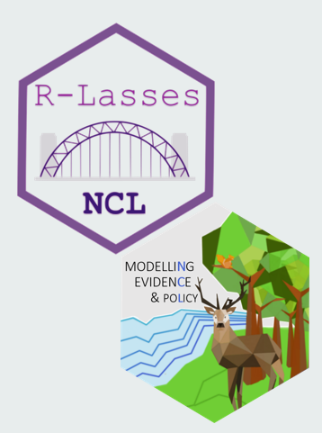
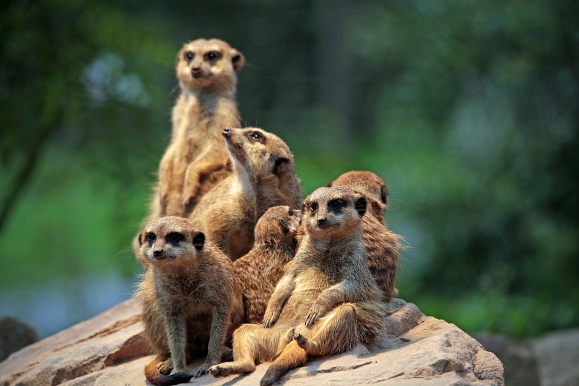
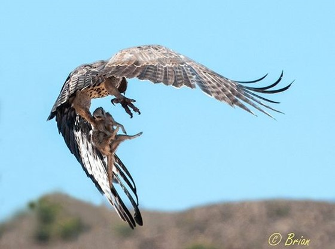
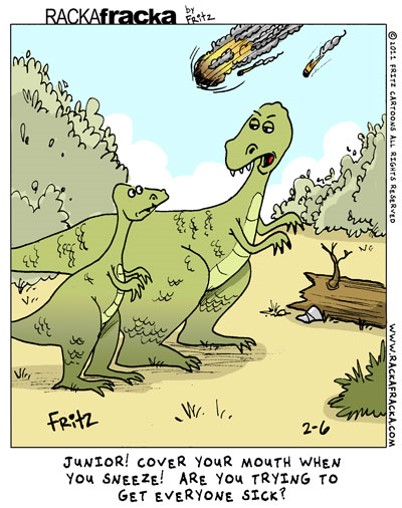
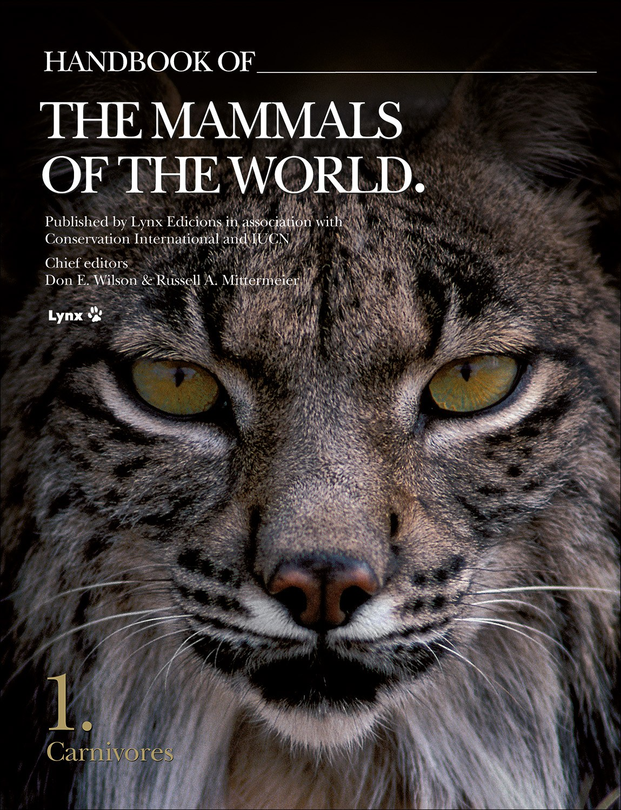
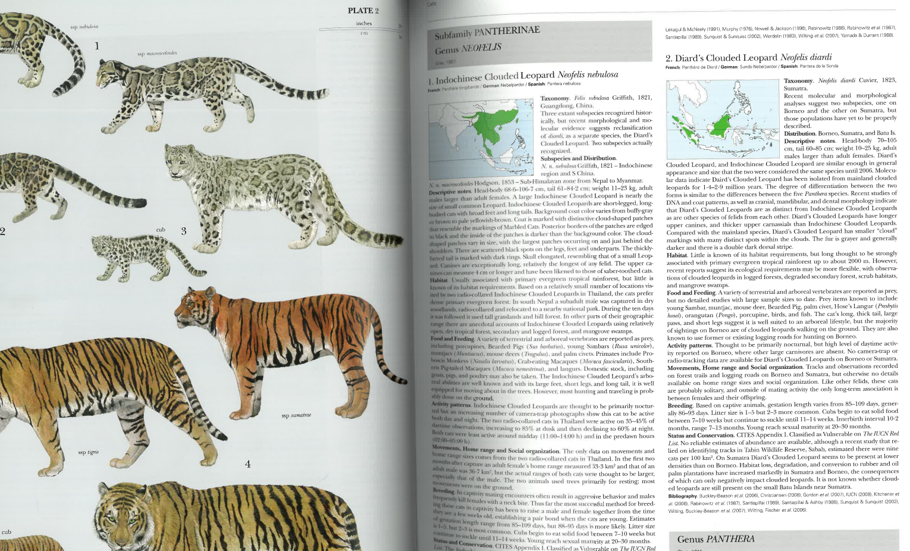
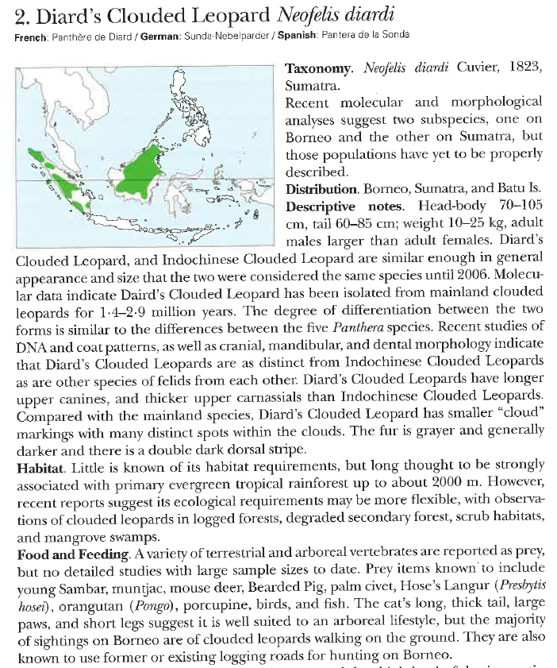
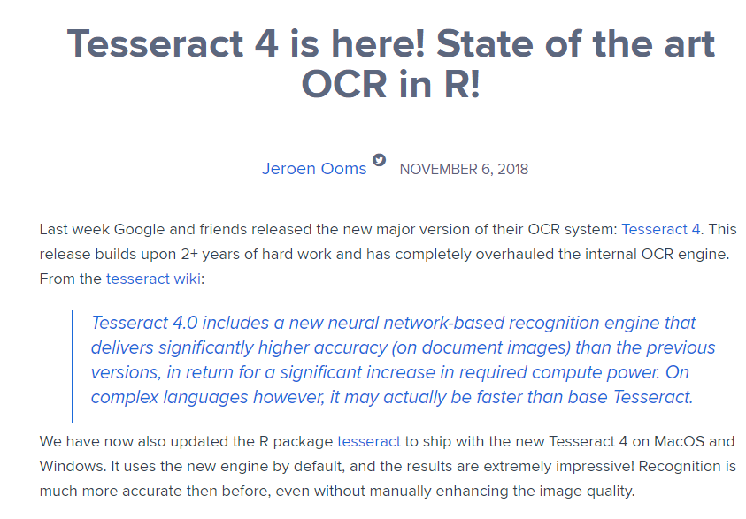
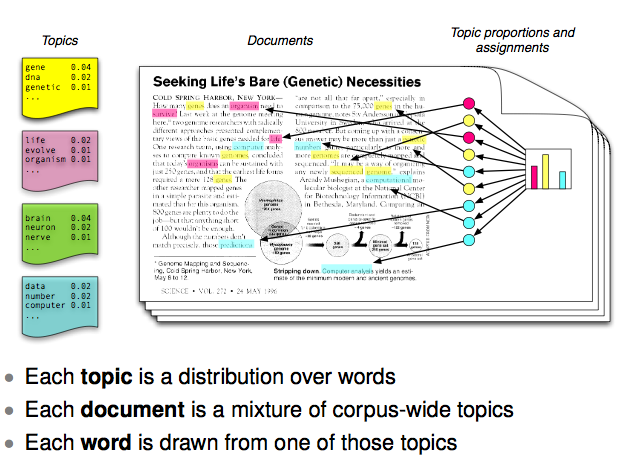

```{r setup, include=FALSE}
options(htmltools.dir.version = FALSE)
```


```{r xaringan-themer, include = FALSE}
library(xaringanthemer)
mono_light(
  base_color = "#1c5253",
  header_font_google = google_font("Josefin Sans"),
  text_font_google   = google_font("Montserrat", "300", "300i"),
  code_font_google   = google_font("Droid Mono")
  
)

```

## Modelling sociality in carnivores

.pull-left[
###Jess Ward
`r icon::fa("twitter")` @JKRWard

###Modelling evidence and Policy group

`r icon::fa("twitter")` @ModEviPol


]

.pull-right[



]

---

# Social carnivores


---
class: inverse, center, middle

# Why be social?

---
##  Decreased predation risk

<center>
<iframe src="https://giphy.com/embed/xmz2JEFmNsGru" width="580" height="580" frameBorder="0" class="giphy-embed" allowFullScreen></iframe>
</center>

???

these are my notes 
---
##  Increased prey capture

<center>
<iframe src="https://giphy.com/embed/DnLHC6vKyRrgY" width="580" height="580" frameBorder="0" class="giphy-embed" allowFullScreen></iframe>
</center>

---
##  Cooperative rearing of young

<center>
<iframe src="https://giphy.com/embed/ZvPVEvQWRFPAQ" width="580" height="580" frameBorder="0" class="giphy-embed" allowFullScreen></iframe>
</center>

---
##  Increased visibility to predators

<center>

</center>

---
##  Increased visibility to predators

<center>

</center>

---
##  Increased transmission of disease

<center>

</center>

---
##  Increased competition
<center>
<iframe src="https://giphy.com/embed/uojwNw5G9sWyI" width="480" height="292" frameBorder="0" class="giphy-embed" allowFullScreen></iframe>
</center>

---
# Diet and feeding


---

# Extracting information

.pull-left[


]


.pull-right[


]


---

.center[

]

---

# Digitizing the information
.center[

]
---

# Digitizing the information

.pull-left[


]

.pull-right[


 
 

 
]

---
# Digitizing the information 

```{r echo = FALSE, warning=FALSE, message=FALSE}

txts <- readr::read_csv(here::here("Data", "all_txt.csv"))

```


```{r echo = TRUE, eval = FALSE}
clouded_leopard <- tesseract::ocr(clouded_leopard.pdf)

# Diardis clouded leopard	 Little is known of its habitat requirements, 
# but longthought to be strongly associated with primmy evergreen
# tropical rainforesl up to about 2000 m. However recent reports 
# suggest its ecological requirements may be more flexible, with 
# observations of cloudcd leopards in logged forests, degraded 
# secondary forest, scrub habitats and mangrove swamps.	 A variety of 
# terrestrial and arboreal vertebrates are reported as prey,but no
# detailed studies with large sample sizes to date. Prey items known 
# to include young Sambar, muntjac, mouse deer, Bearded Pig, palm Civet,
# Hoses Langur (Praclmishnswi). ()mngutan (Pongo). porcupine, birds,
# and fish. The cats long... 


```

--

```{r echo = FALSE}
head(txts)

```


---

## Topic modelling

.center[

]


---

.center[

]

---
## Topic modelling

```{r topic mod setup, echo=FALSE,include=FALSE}

library(readr)
library(dplyr)
library(here)
library(tidyr)
library(bibliometrix)
library(tm)
library(slam)
library(lme4)
library(topicmodels)
#read in data 
# convert the information for each spcolumns one and three I want to combine the two columns together so that I have one bit of text per species
#convert the information to a list


# the model is running on all of the families for which i have text extracted 
#from mammals of the world book
dogtxt <- read_csv(here("Data/all_txt.csv")) %>%
  select(., `Food and feeding`, Habitat) %>% unite(txt, sep = " ")

dognms <- read_csv(here("Data/all_txt.csv")) %>% select(., Predator)
dognms <- as.vector(dognms$Predator)
dogtxt <- as.vector(dogtxt$txt)
dogtxt <- as.list(dogtxt)
# convert the list to a corpus
docs <- Corpus(VectorSource(dogtxt))

# tidy the text
# transform to lower case
docs <-tm_map(docs,content_transformer(tolower))
#writeLines(as.character(docs[[1]]))
# remove stopwords
sort(stopwords("english"))
docs <- tm_map(docs, removeWords, stopwords("english"))
# Change hyphen and slash to space
toSpace <- content_transformer(function(x, pattern) { return (gsub(pattern, " ", x))})
docs <- tm_map(docs, toSpace, "-")
docs <- tm_map(docs, toSpace, "/")
# remove punctuation
docs <- tm_map(docs, removePunctuation)
# remove numbers
docs <- tm_map(docs, removeNumbers)
# remove whitespace
docs <- tm_map(docs, stripWhitespace)
#writeLines(as.character(docs[[1]]))


# stem the document
docs <- tm_map(docs,stemDocument)
#writeLines(as.character(docs[[1]]))

# create document term matrix
dtm <- DocumentTermMatrix(docs)
#dim(dtm)
# Convert rownames to article IDs
rownames(dtm) <- dognms


# remove words occurring in (2?) or fewer documents

## Create binary matrix to count number of articles that each word appears in
dtmbin <- dtm
dtmbin[which(apply(dtmbin, 2, function(x) x>=1))] <- 1
## Have a look at the proportion of words contained in N or fewer articles...
length(which(col_sums(dtmbin)<=1))/ncol(dtmbin)
length(which(col_sums(dtmbin)<=2))/ncol(dtmbin)
length(which(col_sums(dtmbin)<=5))/ncol(dtmbin)
length(which(col_sums(dtmbin)<=10))/ncol(dtmbin)
## Remove words occuring in only 5 or fewer documents
#dtm <- dtm[,-which(col_sums(dtmbin)<=5)]
dim(dtm)

ntopics <- 10
tmod <- LDA(dtm, k=ntopics, method="Gibbs", control=list(burnin=1000, thin=100, iter=1000, best=T))


terms_df <- as.data.frame(terms(tmod, 10))
```

.pull-left[
📦 bibliometrix

📦 slam

📦 tm

📦 topicmodels
]

.pull-right[
 `r length(dtm$dimnames$Docs)` "documents" had habitat and feeding information
 
 `r length(dtm$dimnames$Terms)` words were contained in the corpus after stemming
]

```{r echo = FALSE}

terms_df %>% select(-9, -10) %>% head(.)

```


---
class: inverse, center, middle

# Get Started

